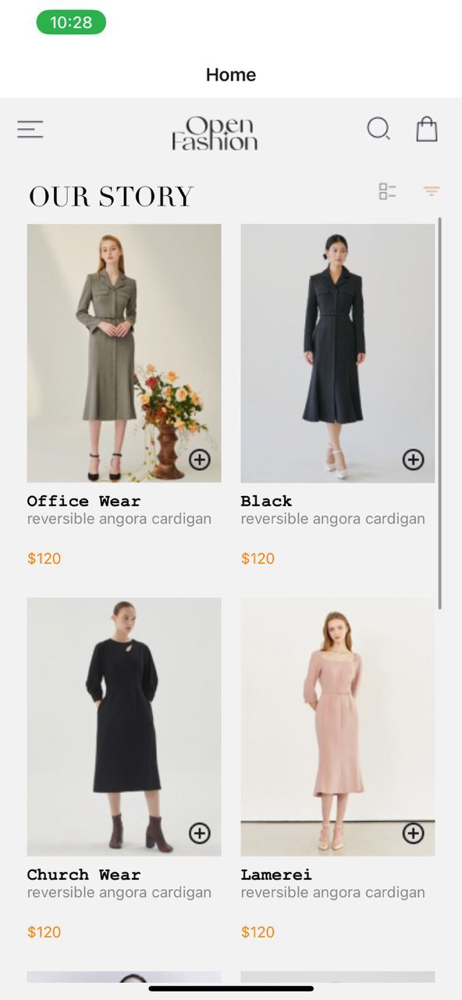
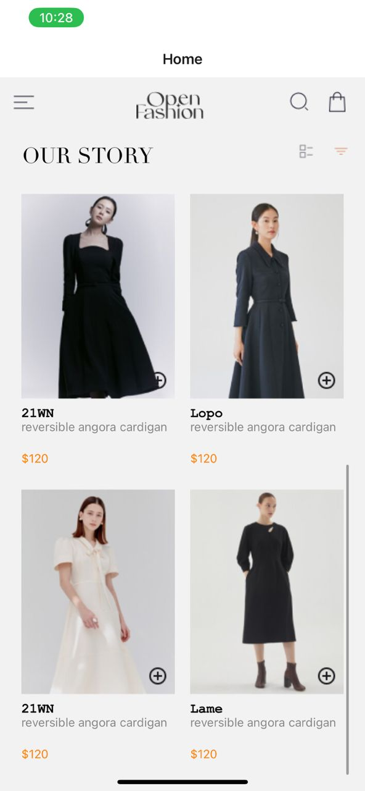
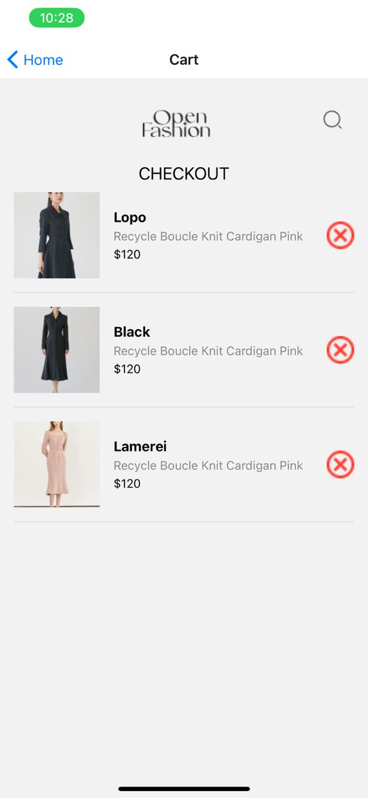

# rn-assignment6-11013649

Design Choices
Navigation: Used React Navigation to create tab-based navigation between the Home and Cart screens.
State Management: Managed cart state within the application using React's useState hook.
Local Storage: Utilized AsyncStorage to locally persist cart items on the device.
Implementation
HomeScreen: Lists available products and allows users to add items to their cart.
CartScreen: Shows the items in the user's cart and provides an option to remove items.
Local Storage: Ensures cart items are saved locally using AsyncStorage for session persistence.

SCREENSHOTS:

Home Screen:

Cart Screen:

How to Run;

1. Clone your repository.
2. Run `npm install` to install dependencies.
3. Run `expo start` to start the application.
